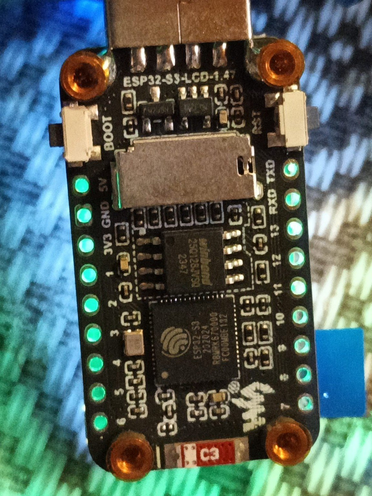

# ESP32-S3-LCD-1.47 Lab



Учебный и прикладной GitHub-проект для платы **Waveshare ESP32-S3-LCD-1.47**
с USB-A, экраном ST7789 172 x 320, слотом microSD, 16 МБ Flash и 8 МБ PSRAM.

Предлагаемое имя отдельного репозитория:

```text
esp32-s3-lcd-1.47-lab
```

Эта плата заслуживает отдельного репозитория, а не раздела в проекте обычного
ESP32: у неё собственная разводка дисплея, SD-карты, RGB-светодиода и USB.

## Что уже подготовлено

Основная прошивка `src/main.cpp` превращает плату в небольшой диагностический
терминал:

- показывает модель микроконтроллера, частоту, Flash, PSRAM и свободную память;
- проверяет наличие microSD и показывает её объём;
- сканирует Wi-Fi и выводит сети с уровнем сигнала;
- показывает таблицу выводов встроенных устройств;
- переключает страницы кнопкой **BOOT**;
- использует встроенный RGB-светодиод как индикатор состояния;
- собирается в PlatformIO и проверяется через GitHub Actions.

> **Статус v0.1-alpha:** проект подготовлен по официальной распиновке Waveshare
> и рабочему способу инициализации ST7789. Физическая проверка именно на вашей
> плате ещё не выполнена. Сначала сохраните заводскую прошивку, затем прошейте
> пример `01_display_test`.

## Быстрый старт в PlatformIO

1. Установите VS Code и расширение PlatformIO.
2. Откройте папку проекта.
3. Подключите плату через USB-удлинитель или USB-хаб.
4. Сначала сохраните заводскую прошивку по инструкции
   [docs/firmware-backup.md](docs/firmware-backup.md).
5. Выполните:

```bash
pio run
pio run -t upload
pio device monitor
```

В `platformio.ini` закреплена среда Arduino-ESP32 3.x. Официальная документация
Waveshare требует пакет ESP32 версии не ниже 3.0.2.

## Arduino IDE

Инструкция и рекомендуемые параметры находятся в
[docs/arduino-ide.md](docs/arduino-ide.md).

Для первичной проверки можно открыть:

```text
examples/01_display_test/01_display_test.ino
```

## Распиновка встроенных устройств

### Дисплей ST7789

| Сигнал | GPIO |
|---|---:|
| MOSI | 45 |
| SCLK | 40 |
| CS | 42 |
| DC | 41 |
| RESET | 39 |
| Подсветка | 48 |

### microSD в режиме SD_MMC

| Сигнал | GPIO |
|---|---:|
| CMD | 15 |
| CLK | 14 |
| D0 | 16 |
| D1 | 18 |
| D2 | 17 |
| D3 | 21 |

Встроенный адресный RGB-светодиод подключён к **GPIO38**, кнопка BOOT — к
**GPIO0**. Полная памятка: [docs/pinout.md](docs/pinout.md).

## Структура

```text
.
├── src/main.cpp                 # диагностическая прошивка
├── include/board_config.h       # единая распиновка платы
├── examples/
│   ├── 01_display_test/         # минимальный тест экрана
│   ├── 02_sd_card_test/         # проверка microSD
│   └── 03_wifi_scanner/         # сканер Wi-Fi на экране
├── docs/
│   ├── pinout.md
│   ├── arduino-ide.md
│   ├── firmware-backup.md
│   └── roadmap.md
├── tools/backup-factory.ps1
├── platformio.ini
└── .github/workflows/build.yml
```

## Публикация на GitHub

Команды для создания первого коммита и отправки в новый репозиторий находятся
в [docs/publish-to-github.md](docs/publish-to-github.md).

## Важные замечания

- Это модель **ESP32-S3-LCD-1.47 с USB-A**.
- Не путать с **ESP32-S3-LCD-1.47B**: у неё USB-C, другая подсветка и
  дополнительные узлы.
- Не путать с сенсорной `ESP32-S3-Touch-LCD-1.47`: её распиновка отличается.
- На плате уже есть полезная заводская диагностическая прошивка. Сохраните её
  до первого стирания Flash.
- При проблемах с загрузкой удерживайте BOOT, кратко нажмите RESET, отпустите
  RESET, затем BOOT.

## План развития

Следующие этапы: LVGL, просмотр изображений с microSD, USB-накопитель,
UART/I2C-терминал, MQTT-панель и компактные измерительные приложения.
Подробно: [docs/roadmap.md](docs/roadmap.md).

## Источники

- [Официальная Wiki Waveshare](https://www.waveshare.com/wiki/ESP32-S3-LCD-1.47)
- [Официальный комплект примеров](https://files.waveshare.com/wiki/ESP32-S3-LCD-1.47/ESP32-S3-LCD-1.47-Demo.zip)
- [Arduino-ESP32](https://docs.espressif.com/projects/arduino-esp32/en/latest/)
- [Adafruit ST7735/ST7789 Library](https://github.com/adafruit/Adafruit-ST7735-Library)
- [Документация esptool](https://docs.espressif.com/projects/esptool/en/latest/esp32s3/)

## Лицензия

Оригинальный код проекта распространяется по лицензии MIT. Сторонние
библиотеки и официальные материалы Waveshare имеют собственные лицензии.
